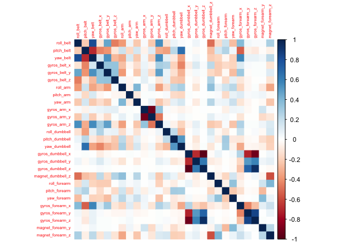

This file and contents of this repository has been created to comply
with the assessment needs of a MOOC - Practical Machine Learning by John
Hopkins University as a part of the Data Science specialization track in
Coursera.

## Introduction

The background and the link to data can be found in (README.md)[https://github.com/hisscaredbrain/pmlCourseProject/blob/main/README.md] file.
People regularly do is quantify how much of a particular activity they
do, but they rarely quantify how well they do it. In this project, we
will be to use data from accelerometers on the belt, forearm, arm, and
dumbell of 6 participants to predict the manner in which 6 persons did
the exercise. This report describes how the model is built, how cross
validation is used, inference of the sample error, and reasoning behind
the design choices. The prediction model will be used to predict 20
different test cases.

## Working Environment

Load the necessary libraries and install dependencies wherever needed.
Set seed to ensure reproducibility while building models and working
with data to ensure consistency in results.

``` r
library(rattle)
library(caret)
library(dplyr)
library(rpart)
library(rpart.plot)
library(corrplot)
library(randomForest)
library(RColorBrewer)

set.seed(56789)
```

## Get the data

The data for this exercise comes from [this
source](http://web.archive.org/web/20161224072740/http:/groupware.les.inf.puc-rio.br/har).

-   Create a directory for data in the current working directory.
-   Download the data files ONLY once
-   Read in the data into variables.
-   Delete the file handling variables to keep the working environment
    clean.

``` r
# Set the working directory
setwd("~/Projects/DataScience_Coursera/PracticalMachineLearning/pmlCourseProject")

# URLs for training and test data
trainDataURL <- "https://d396qusza40orc.cloudfront.net/predmachlearn/pml-training.csv"
testDataURL <- "https://d396qusza40orc.cloudfront.net/predmachlearn/pml-testing.csv"
trainfn <- "./data/pml-training.csv"
testfn <- "./data/pml-test.csv"

# Download the data files if they are not present in the data folder
if(!file.exists(trainfn)) {
  download.file(trainDataURL, destfile = trainfn, method = "curl")
}

if(!file.exists(testfn)) {
  download.file(testDataURL, destfile = testfn, method = "curl")
}

# Read in the raw data, replace empty and invalid entries by NA
trainDataRaw <- read.csv(trainfn, sep = ",", header = TRUE, na.strings = c("NA", "", '#DIV/0!'))
testDataRaw <- read.csv(testfn, sep = ",", header = TRUE, na.strings = c("NA", "", '#DIV/0!'))

# Delete file handling variables
rm(trainDataURL)
rm(testDataURL)
rm(trainfn)
rm(testfn)

#Check the dimensions of read in data
dim(trainDataRaw)
```

    ## [1] 19622   160

``` r
dim(testDataRaw)
```

    ## [1]  20 160

Both data sets contain 160 variables. However the size of the training
data set is 19622 as compared to just 20 for test data set.

## Preprocessing the data

In this step, the data will be cleaned to exclude irrelevant,
insignificant values or variables with NA. 1. In first step, all
variables with `NA`s will be identified and filtered out.

``` r
#Identify variables without NA
varWONA <- (colSums(is.na(trainDataRaw)) == 0)

# Filter out variables with NA
trainValidData <- trainDataRaw[, varWONA]
testValidData <- testDataRaw[, varWONA]

# Observe the dimensions of pruned dataset
dim(trainValidData)
```

    ## [1] 19622    60

``` r
dim(testValidData)
```

    ## [1] 20 60

``` r
# Delete variables from work space to keep it de-cluttered
rm(trainDataRaw)
rm(testDataRaw)
rm(varWONA)
```

1.  Now identify and prune the set leaving out all variables with
    insignificant values.

``` r
# Identify variables with insignificant values
InSigVar <- nearZeroVar(trainValidData, saveMetrics = TRUE)
#head(InSigVar, 15)

trainSigData <- trainValidData[, !InSigVar$nzv]
testSigData <- testValidData[, !InSigVar$nzv]

# Observe the dimensions of pruned dataset
dim(trainSigData)
```

    ## [1] 19622    59

``` r
dim(testSigData)
```

    ## [1] 20 59

``` r
# Delete variables from work space to keep it de-cluttered
rm(InSigVar)
rm(trainValidData)
rm(testValidData)
```

Close to 1/3 of the variables have been pruned. We started with 160 and
are now with 100 variables after account of insignificant values.

1.  Identify and remove variables which do not contribute or relate to
    accelerometer measurements.

``` r
nonAccel <- grepl("^X|timestamp|user_name", names(trainSigData))
# Prune non accelerometer data
trainAccelData <- trainSigData[, !nonAccel]
testAccelData <- testSigData[, !nonAccel]
# trainFinalData <- trainSigData[, !nonAccel]
# testFinalData <- testSigData[, !nonAccel]


# Observe the dimensions of pruned dataset
dim(trainAccelData)
```

    ## [1] 19622    54

``` r
dim(testAccelData)
```

    ## [1] 20 54

``` r
# dim(trainFinalData)
# dim(testFinalData)


# Delete variables from work space to keep it de-cluttered
rm(trainSigData)
rm(testSigData)
rm(nonAccel)
```

We have further reduced the variables to 54.

1.  Lastly remove the variables with are non-numeric

``` r
numerVar <- which(lapply(trainAccelData, class) == "numeric")
names(numerVar) <- NULL
storeClass <- trainAccelData$classe
trainFinalData <- trainAccelData[, numerVar]
trainFinalData$classe <- storeClass

testFinalData <- testAccelData[, numerVar]

# Observe the dimensions of pruned dataset
dim(trainFinalData)
```

    ## [1] 19622    28

``` r
#dim(testFinalData)

# Delete variables from work space to keep it de-cluttered
rm(trainAccelData)
rm(testAccelData)
rm(numerVar)
```

This final data set contains less than 1/4 of variables from the raw
data set. Let us look at a correlation matrix to see if we have any
over-dependence on variables. Ensure to remove the problem_id column
first.

``` r
corrplot(cor(trainFinalData[, -length(names(trainFinalData))]), method = "color", tl.cex = 0.5)
```



## Split training set

The training data set will be split into 70:30 subsets of training and
validation data sets.

``` r
split <- createDataPartition(trainFinalData$classe, p = 0.70, list = FALSE)
validation <- trainFinalData[-split, ]
onlyTrain <- trainFinalData[split, ]

# Observe the dimensions of splitted datasets
dim(onlyTrain)
```

    ## [1] 13737    28

``` r
dim(validation)
```

    ## [1] 5885   28

``` r
# Delete variables from work space to keep it de-cluttered
rm(split)
```

## Build Models for Prediction

In this section we explore two models - Decision Tree and the Random
Forest Method.

### Decision Tree

Based on the course content, we know effectiveness of decision trees are
in general lower than Random Forest. However, this hyptothesis can also
be tested while using them for prediction.

``` r
fitDtm <- rpart(classe ~., data=onlyTrain, method = "class")
prp(fitDtm)
```


This model is now used to estimate the performance using the validation
data subset.

``` r
predDtm <- predict(fitDtm, validation, type = "class")
confusionMatrix(as.factor(validation$classe), predDtm)
```

    ## Confusion Matrix and Statistics
    ## 
    ##           Reference
    ## Prediction    A    B    C    D    E
    ##          A 1396   49   97   36   96
    ##          B  222  741  129   37   10
    ##          C   40   94  800   83    9
    ##          D   66   50  132  685   31
    ##          E   12  117  131  107  715
    ## 
    ## Overall Statistics
    ##                                           
    ##                Accuracy : 0.737           
    ##                  95% CI : (0.7255, 0.7482)
    ##     No Information Rate : 0.295           
    ##     P-Value [Acc > NIR] : < 2.2e-16       
    ##                                           
    ##                   Kappa : 0.6671          
    ##                                           
    ##  Mcnemar's Test P-Value : < 2.2e-16       
    ## 
    ## Statistics by Class:
    ## 
    ##                      Class: A Class: B Class: C Class: D Class: E
    ## Sensitivity            0.8041   0.7050   0.6206   0.7226   0.8304
    ## Specificity            0.9330   0.9177   0.9508   0.9435   0.9270
    ## Pos Pred Value         0.8339   0.6506   0.7797   0.7106   0.6608
    ## Neg Pred Value         0.9193   0.9347   0.8994   0.9466   0.9696
    ## Prevalence             0.2950   0.1786   0.2190   0.1611   0.1463
    ## Detection Rate         0.2372   0.1259   0.1359   0.1164   0.1215
    ## Detection Prevalence   0.2845   0.1935   0.1743   0.1638   0.1839
    ## Balanced Accuracy      0.8686   0.8114   0.7857   0.8330   0.8787

Lets extract the accuracy and Out-of-Sample Error from the above matrix.

``` r
accuracyDtm <- postResample(predDtm, as.factor(validation$classe))
outSampErrorDtm <- (1 - as.numeric(confusionMatrix(as.factor(validation$classe), predDtm)$overall)[1])

# Delete variables from work space to keep it de-cluttered
rm(fitDtm)
rm(predDtm)
```

The estimated accuracy of the Decision Tree method is 73.6958369% and
the estimated Out-of-Sample Error is 26.3041631%.

### Random Forest Method

In the course we have learnt that random forest provides reasonably good
performance with default settings. In the below model we are using
5-fold cross validation.

``` r
fitRfm <- train(classe ~., method="rf", data = onlyTrain, trControl = trainControl(method = "cv", 5), ntree = 250)
fitRfm
```

    ## Random Forest 
    ## 
    ## 13737 samples
    ##    27 predictor
    ##     5 classes: 'A', 'B', 'C', 'D', 'E' 
    ## 
    ## No pre-processing
    ## Resampling: Cross-Validated (5 fold) 
    ## Summary of sample sizes: 10988, 10990, 10991, 10990, 10989 
    ## Resampling results across tuning parameters:
    ## 
    ##   mtry  Accuracy   Kappa    
    ##    2    0.9914832  0.9892246
    ##   14    0.9903911  0.9878439
    ##   27    0.9882075  0.9850820
    ## 
    ## Accuracy was used to select the optimal model using the largest value.
    ## The final value used for the model was mtry = 2.

Now, lets use the validation data set and see the performance if the
model.

``` r
predRfm <- predict(fitRfm, validation)
confusionMatrix(as.factor(validation$classe), predRfm)
```

    ## Confusion Matrix and Statistics
    ## 
    ##           Reference
    ## Prediction    A    B    C    D    E
    ##          A 1673    1    0    0    0
    ##          B    4 1130    3    0    2
    ##          C    0    3 1020    3    0
    ##          D    0    0    2  962    0
    ##          E    0    1    0    3 1078
    ## 
    ## Overall Statistics
    ##                                           
    ##                Accuracy : 0.9963          
    ##                  95% CI : (0.9943, 0.9977)
    ##     No Information Rate : 0.285           
    ##     P-Value [Acc > NIR] : < 2.2e-16       
    ##                                           
    ##                   Kappa : 0.9953          
    ##                                           
    ##  Mcnemar's Test P-Value : NA              
    ## 
    ## Statistics by Class:
    ## 
    ##                      Class: A Class: B Class: C Class: D Class: E
    ## Sensitivity            0.9976   0.9956   0.9951   0.9938   0.9981
    ## Specificity            0.9998   0.9981   0.9988   0.9996   0.9992
    ## Pos Pred Value         0.9994   0.9921   0.9942   0.9979   0.9963
    ## Neg Pred Value         0.9991   0.9989   0.9990   0.9988   0.9996
    ## Prevalence             0.2850   0.1929   0.1742   0.1645   0.1835
    ## Detection Rate         0.2843   0.1920   0.1733   0.1635   0.1832
    ## Detection Prevalence   0.2845   0.1935   0.1743   0.1638   0.1839
    ## Balanced Accuracy      0.9987   0.9968   0.9969   0.9967   0.9987

``` r
accuracyRfm <- postResample(predRfm, as.factor(validation$classe))
outSampErr <- (1 - as.numeric(confusionMatrix(as.factor(validation$classe), predRfm)$overall[1]))
```

The Estimated Accuracy of the Random Forest Model is 99.6261682% and the
Estimated Out-of-Sample Error is 0.3738318%.  
As expected, Random Forests method yields better results in comparision
to Decision Trees.

## Prediction with Test Data Set

The Random Forest model is now applied to the original testing data set
downloaded from the data source. We remove the non-numeric problem_id
column first.

``` r
#rm(accuracy)
#rm(ose)
#predict(fitRfm, testFinalData[, -length(names(testFinalData))])
predict(fitRfm, testFinalData)
```

    ##  [1] B A B A A E D B A A B C B A E E A B B B
    ## Levels: A B C D E
